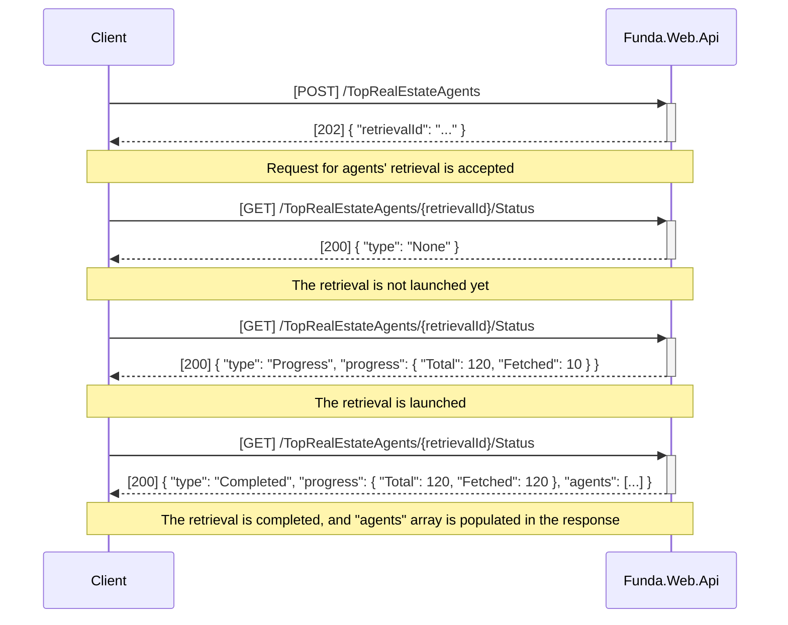
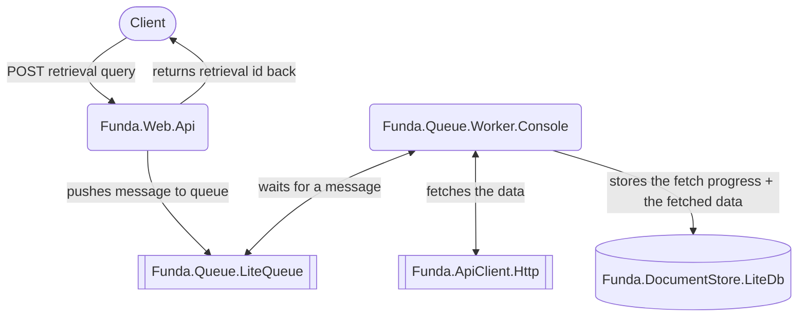

# Funda

Find out which real estate agent in the Netherlands has the most properties for sale at [Funda](https://www.funda.nl/).
Get a list of top N agents for specific search criteria: 
- location (Amsterdam, Rotterdam, etc) 
- and outdoor space type (Balcony, Roof, Garden, etc).


## Getting Started
ASP.NET Core 6, .NET 6, C# 

Solution is built using Clean Architecture + CQRS and asynchronous processing of a long-running request (like fetching a large set of objects listed in Funda).


### Key things:
- Business logic is located in `Funda.Core`
- Tired to use generated WCF Service Reference (http://partnerapi.funda.nl/feeds/Aanbod.svc?wsdl) but it keept failing with non-self-explanatory errors so I moved to calling the service from http client.
- Retries and circuit breaker policies are implemented in `Funda.ApiClient.Http` (ServiceCollectionExtensions). Also there is `HttpMessageHandlerFactory.RateLimiter` to handle the Funda's "rate limiter" - API requests are limited to 100 requests per minute.
- Apply `SortBy.DateAscending` for Funda search queries to avoid a `"Page drift"` when new objects are added during the fetch

## System design decisions

We don't know the size of the dataset to be processed, Funda can store millions of objects listed for sale. 
So processing all of them synchronously (within a single long-running API request/response call) does not make any sense if we want to have a scalable solution. 

#### This is what the communication between the client and WebApi looks like:


#### This is how the search request is handled under the hood:



## Steps to run the solution
* Restore NuGet packages
* Make `Funda.Web.Api` & `Funda.Queue.Worker.Console` projects to be Multiple Startup Projects (with Action `'Start'`) in Visual Studio (VS) so that when you run the solution all of them start at the same time
* Run the solution from VS
* Run the following command to issue a fetch request (or use a Swagger UI) that will be put in a queue and processed asynchronously by a background worker. The Api will return you `retrievalId` (Guid) that is required to receive the result of the background fetch
```bash
curl -X 'POST' \
  'https://localhost:7215/v1/TopRealEstateAgents' \
  -H 'accept: text/plain' \
  -H 'Content-Type: application/json' \
  -d '{
    "location": "Amsterdam",
    "outdoor": "Tuin",
    "topNumberOfAgents": 10
  }'
```
* Poll the following command to see the fetch process
```bash
curl -X 'GET' \
  'https://localhost:7215/v1/TopRealEstateAgents/{retrievalId}/Status' \
  -H 'accept: text/plain'
```
